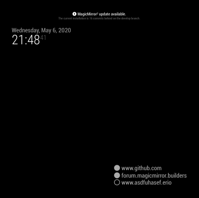
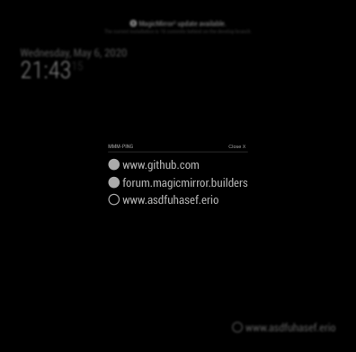

# MMM-ping [](https://raw.githubusercontent.com/fewieden/MMM-ping/master/LICENSE) [](https://travis-ci.org/fewieden/MMM-ping) [](https://codeclimate.com/github/fewieden/MMM-ping) [](https://snyk.io/test/github/fewieden/mmm-ping)

Ping Module for MagicMirror<sup>2</sup>

## Example

 

## Dependencies

* An installation of [MagicMirror<sup>2</sup>](https://github.com/MichMich/MagicMirror)
* OPTIONAL: [Voice Control](https://github.com/fewieden/MMM-voice) and [MMM-Modal](https://github.com/fewieden/MMM-Modal)
* npm
* [ping](https://www.npmjs.com/package/ping)

## Installation

* Clone this repo into `~/MagicMirror/modules` directory.
* Configure your `~/MagicMirror/config/config.js`:

```js
{
    module: 'MMM-ping',
    position: 'bottom_right',
    config: {
        hosts: [
            'www.github.com',
            'forum.magicmirror.builders'
        ]
    }
}
```

* Run command `npm install --production` in `~/MagicMirror/modules/MMM-ping` directory.

## Config Options

| **Option** | **Default** | **Description** |
| --- | --- | --- |
| `colored` | `false` | show badge in color or not |
| `display` | `'both'` | what should be displayed `'online'`, `'offline'` or `'both'` |
| `hosts` | `[]` | addresses to ping |
| `updateInterval` | `5` | how often the module should ping the hosts in minutes |
| `font` | `'medium'` | font size `'xsmall'`, `'small'`, `'medium'`, `'large'` or `'xlarge'` |
| `transitionTime` | `300` | Time (in milliseconds) the transition for a new update in the DOM should take. |

## OPTIONAL: Voice Control and Modal

This module supports voice control by [MMM-voice](https://github.com/fewieden/MMM-voice) and [MMM-Modal](https://github.com/fewieden/MMM-Modal).
In order to use this feature, it's required to install the voice and modal modules. There are no extra config options for voice control and modals needed.

### Mode

The voice control mode for this module is `PING`

### List of all Voice Commands

* OPEN HELP -> Shows the information from the readme here with mode and all commands.
* CLOSE HELP -> Hides the help information.
* SHOW ALL HOSTS -> Shows a list of all hosts with online state online and offline.
* HIDE HOSTS -> Hide the list.

## Developer

* `npm run lint` - Lints JS and CSS files.
* `npm run docs` - Generates documentation.
